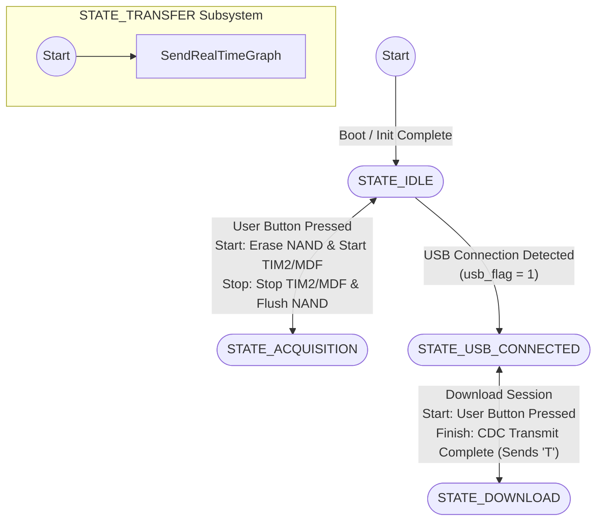
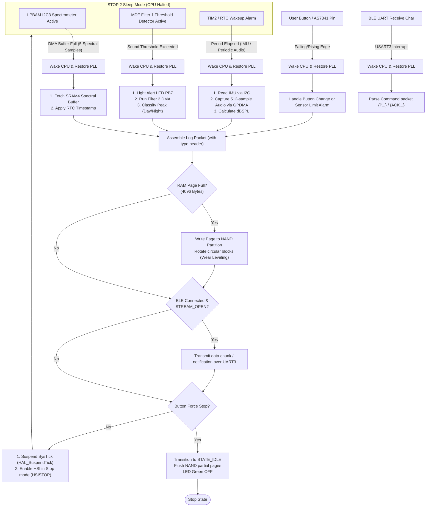

# 🌟 STM32U575 MainBoard Firmware - Wearable Logger

This repository contains the firmware for the wearable **MainBoard** based on the **STM32U575RITXQ** (ARM Cortex-M33) microcontroller. This project serves as a baseline template and experimental platform for the *Smart Wearables* course, focusing on ultra-low-power optimization, multi-sensor integration, non-volatile SPI NAND Flash memory logging, and wired/wireless data retrieval.

The codebase is organized into several Git branches, each targeting a specific hardware peripheral or low-power acquisition technique (e.g., LPBAM, MDF, USB, BLE).

---

## 🛠️ Hardware Architecture & Peripherals

The firmware leverages the advanced hardware features of the ultra-low-power **STM32U575** MCU:
*   **Microcontroller:** STM32U575RITXQ (up to 160 MHz, TrustZone, isolated SRAM blocks SRAM1/2/3/4).
*   **Sensors:**
    *   **I2C IMU (LSM6DSOX or compatible):** For recording real-time Acceleration and Angular Velocity.
    *   **I2C3 AS7341 Spectrometer:** An 11-channel spectral sensor for color physical intensity and ambient flicker analysis.
    *   **IMP34DT05 MEMS Digital Microphone:** Connected to the **MDF (Multichannel Digital Filter)** peripheral for environmental sound level logging.
*   **Data Storage:** **W25N SPI NAND Flash** (connected via **SPI2**), utilized for persistent, offline logging of sensor sessions.
*   **Connectivity:**
    *   **Bluetooth Low Energy (BLE):** Connected via a serial UART interface (**USART3**).
    *   **USB OTG Full Speed:** Configured as a **Virtual COM Port (VCP)** for high-speed data download to a PC.
*   **User Interface:**
    *   **User Button (PC13):** Hardware trigger for Finite State Machine (FSM) state transitions.
    *   **RGB LEDs:** Real-time visual feedback (Red = Initialization/Error, Green = Active Acquisition or USB Connected).

---

## 🌀 Current Finite State Machine (FSM)

The main program flow in [Core/Src/main.c](file:///C:/Users/fanin/SWDP/FirmWare/MainBoard_Firmware/Core/Src/main.c) is governed by a state machine defined by the `AppState` enum:



### State Descriptions:
1.  **`STATE_IDLE`**: Device is at rest, waiting for user interaction. If USB connection is detected (`usb_flag = 1`), it transitions to `STATE_USB_CONNECTED`.
2.  **`STATE_ACQUISITION`**: Active sensor sampling. Data is buffered in RAM and written in 4KB pages to the SPI NAND Flash.
3.  **`STATE_USB_CONNECTED`**: USB is connected and enumerated. The Green LED is turned ON.
    > [!IMPORTANT]
    > **Unidirectional USB Trap:** Once the system enters the USB loop (`STATE_USB_CONNECTED` or `STATE_DOWNLOAD`), there is no software transition back to `STATE_IDLE` or `STATE_ACQUISITION`. The MCU stays in this cycle until a hardware reset (button/power cycle) is triggered.
4.  **`STATE_DOWNLOAD`**: Sequentially reads logged NAND Flash pages and transmits them over USB VCP. Sends the character `'T'` upon completion and returns to `STATE_USB_CONNECTED`.
5.  **`STATE_TRANSFER`**: Reserved for streaming operations (e.g., real-time BLE graphing).

---

## 🌿 Git Branch Map & Features Reference

The project is structured across six main development branches:

| Branch | Primary Sensor | Key Peripherals | Low-Power / DMA | Software Utilities |
| :--- | :--- | :--- | :--- | :--- |
| **`main`** | IMU (Acc/Gyr) | I2C, SPI2, TIM2, USB VCP, USART3 | Standard TIM interrupts | Baseline Flash Logging |
| **`SP_Develop`** | AS7341 Spectrometer | I2C3, LPTIM1, LPDMA, LPBAM | **STOP2 Mode / LPBAM** | `spectral_plotter.py` |
| **`SP_Develop_demo`** | AS7341 Spectrometer | I2C3, RTC, SPI2 (NAND) | Standard 1Hz Polling | RTC timestamped logs |
| **`feature-bluetooth-communication`**| IMU / AS7341 | USART3 (BLE IT Rx), SPI2 | Non-blocking serial parser | Handshake & BLE Download CRC16/32 |
| **`microphone`** | MEMS Mic IMP34DT05 | MDF (Filter 0/1/2), GPDMA, RTC | Double Filter / Over-Limit | Sound level logs & Cooldown |
| **`microphone_demo`** | MEMS Mic IMP34DT05 | MDF (Filter 0/1), GPDMA | Single Filter (Sequential) | Peak monitoring via Console |

---

### 1. `main` (Motion Logger Baseline)
*   **Operation:** Samples Accelerometer and Gyroscope raw data at ~100 Hz using `TIM2` period elapsed interrupts.
*   **Memory Logging:** Builds 17-byte packets (boot-relative timestamp + 6B acc + 6B gyr) structured into 4096-byte RAM pages. Once full, the page is committed to the SPI NAND Flash.
*   **Download:** Triggers serial dump of logged pages via USB VCP when the button is pressed in `STATE_USB_CONNECTED`.
*   **BLE:** Constantly broadcasts raw X-axis acceleration over the BLE interface.

### 2. `SP_Develop` (Low-Power Spectral LPBAM)
*   **Operation:** Tailored for ultra-low-power spectral data collection using **LPBAM (Low Power Background Activity Mode)**.
*   **Low Power Execution:**
    1.  During acquisition, the CPU is suspended in **STOP2 Mode** (`HAL_PWREx_EnterSTOP2Mode`).
    2.  The **LPDMA1** controller and **I2C3** interface remain active in the background, powered by the HSI clock.
    3.  LPTIM1 generates a periodic trigger to query the AS7341 spectral channels into a circular buffer in **SRAM4** (`AS7341_Rx_Buffer`).
    4.  Every 5 samples (completed LPBAM cycle), the `lpbam_cycle_complete` interrupt wakes the CPU, which configures the PLL, logs data to NAND, and goes back to STOP2.
*   **Threshold Interrupts:** Employs the AS7341 hardware interrupt pin (`SP_INT_Pin` on EXTI5) to wake the MCU instantly when light intensity threshold bounds are breached, prompting a BLE alert.
*   **Visualizer:** Includes [spectral_plotter.py] (Tkinter GUI + Matplotlib) to download binary log pages over USB, parse 3 selected physical channels (Deep Blue, Blue, Clear), and plot flicker presence.

### 3. `SP_Develop_demo` (Spectral Polling Demo)
*   **Operation:** Bypasses LPBAM configurations for simpler hardware validation.
*   **Acquisition:** Queries the AS7341 at 1 Hz via manual I2C3 polling and adds calendar timestamps using the hardware **RTC** peripheral.
*   **Safety Limits:** Collects up to 120 samples (2 minutes). Upon completion, it executes `Emergency_Dump_To_NAND()` and reverts to `STATE_IDLE` to protect memory regions.

### 4. `feature-bluetooth-communication` (Advanced Wireless Download)
*   **Operation:** Features an interrupt-driven serial BLE stack on USART3 (baud rate 250000).
*   **Non-Blocking Parsing:** Calls `BLE_ProcessRxBuffer()` in the main loop to read buffered UART bytes and parse structured `{...}` packets or `%...%` status messages.
*   **ITM Trace Redirection:** Redirects `printf` standard output to **ITM Stimulus Port 0** for high-speed hardware tracing, bypassing slower UART print routines.

#### 📡 BLE Communication Protocol Specification

##### 1. Command Parsing (RX State Machine)
The UART RX interrupt maps incoming bytes into a lightweight state machine parsing two message formats:
*   **Status Messages (`%...%`):** Used for connection events.
    *   `%CONNECT%`: Wakes up status, flags `waiting_for_stream = True` and starts a **5-second watchdog**.
    *   `%STREAM_OPEN%`: Handshake confirmation; disables the connection watchdog. If the watchdog expires without receiving `%STREAM_OPEN%`, the MCU invokes `BLE_HardReset()` to reset the module.
    *   `%DISCONNECT%`: Transitions status to `BLE_DISCONNECTED`.
*   **Data Command Packets (`{...}`):**
    *   `ACK Request` (`rx_data_packet[1] == 6`): Responds with a standard ACK frame (`{ \x07 }`).
    *   `Request Page` (`rx_data_packet[1] == 80` / `'P'`): Initiates a wireless dump of a specific NAND page. The absolute page index (24-bit) is extracted from bytes `[2]`, `[3]`, and `[4]`.

##### 2. Chunked Page Transmission (TX Packet Framing)
When transmitting a 4KB (4096 bytes) NAND page over BLE, the MCU splits the buffer into **29 successive chunks** (28 chunks of 151 bytes payload, and 1 chunk of 68 bytes payload) to comply with the BLE module's Maximum Transmission Unit (MTU). 

Each chunk is wrapped in a strict frame structure:

| Field | Byte Offset | Size | Value / Description |
| :--- | :--- | :--- | :--- |
| **Start Byte** | 0 | 1 Byte | ASCII `'{'` (0x7B) |
| **Type** | 1 | 1 Byte | `0x44` (Data), `0x45` (End of Page), `0x46` (End of Data) |
| **Length** | 2 | 2 Bytes | Big-endian size of the Payload field |
| **Payload** | 4 | N Bytes | Raw chunk data (Up to 151 bytes) |
| **CRC16** | 4 + N | 2 Bytes | Big-endian CRC-CCITT (0x1021) calculated over the Payload |
| **End Byte** | 6 + N | 1 Byte | ASCII `'}'` (0x7D) |

*   **Flow Control Emulation:** A **15ms delay** is introduced between successive chunk transmissions to allow the BLE UART Tx buffer to flush safely without hardware-flow-control (RTS/CTS) lines.

##### 3. Page Integrity & Completion Tokens
*   **Page Verification (EOP):** After all 4096 bytes are chunked and sent, the MCU calculates a **CRC32** (`poly = 0xEDB88320`) over the complete raw 4KB page. It then sends a `TYPE_EOP` (0x45) packet whose 4-byte payload is the calculated CRC32. The receiver compares this value against the compiled 4KB buffer to ensure zero byte corruption.
*   **End of Data (EOD):** If a requested logical page maps to an unwritten NAND block (recognized when the first 16 bytes read as `0xFF`) or overflows memory boundaries, the MCU transmits a `TYPE_EOD` (0x46) packet. This informs the client application to close the download thread.


### 5. `microphone` (MDF Sound Level Logger)
*   **Operation:** Monitors ambient sound pressure levels in **dBSPL** using the **MDF (Multichannel Digital Filter)** interface.
*   **Acoustic Monitoring (Filter 0):** Periodically records 512-sample audio buffers at 16 kHz, calculates the Root Mean Square (RMS) value in software, converts it to dBFS, factors in digital microphone sensitivity, and commits the calculated dBSPL value to NAND.
*   **Acoustic Shock Detection (Filter 1 & 2):** Arm the Overrun/Limit Detector (OLD) hardware. When sound levels cross a specified limit, `HAL_MDF_OldCallback` triggers:
    1.  Alert LED (PB7) lights up.
    2.  Filter 2 records a high-speed GPDMA buffer (`audio_buffer_peak`) to calculate the peak dBSPL.
    3.  Acoustic profiles evaluate the threat according to the time of day (RTC):
        *   *Daytime (07:00 - 23:00):* OSHA exposure alerts (Shock >= 140 dBSPL, Pain >= 120 dBSPL, Hazardous >= 85 dBSPL).
        *   *Nighttime (23:00 - 07:00):* Sleep fragmentation warnings (Min alert >= 45 dBSPL, Severe >= 85 dBSPL).
*   **Cooldown Protection:** To prevent battery depletion and flash write wearing in noisy locations, the cooldown module suspends shock logs if events fire closer than 2 seconds apart.

### 6. `microphone_demo` (Simplified Mic Demo)
*   **Operation:** Simplifies the audio architecture by utilizing only **Filter 0** for both continuous monitoring and shock detection.
*   **Peak Hold:** Continually captures audio and tracks the highest absolute peak value (`global_max_peak`), printing updates to the console.

---

## 🔮 Future Merged Architecture & System Flow

To merge all branch functionalities into a single unified firmware, we propose a co-operative, low-power scheduling scheme. 

### Fully Integrated Hardware Interface:
*   **Core Task Scheduler:** Operates in low-power modes (STOP2), woke up by multiple asynchronous events (Timer, DMA, EXTI, UART).
*   **NAND Flash Partitioning:** Divides the NAND flash into distinct partitions (logical blocks 0-511 for IMU, 512-1023 for Spectral, 1024-2047 for Audio & system alerts) with dynamic header parsing.
*   **Dual Communication Channels:** Simultaneously supports wired high-speed USB VCP downloads and OTA BLE chunked page streaming with CRC verification.

### Integrated Low-Power Acquisition Flow:

The diagram below details how the merged firmware manages asynchronous sensor sampling, low-power sleep state entries, memory logging, and real-time alerts:



---

## 💾 NAND Flash Data Layout (Logical Format)

When unified, the Flash memory is organized as follows:
*   **Logical Page Size:** 4096 Bytes
*   **Logical Block Allocation:**
    *   **Blocks 0 - 99:** Reserved for Wear-Leveling and Circular Session metadata headers.
    *   **Blocks 100 - 999:** Motion Log (IMU sensor packets).
    *   **Blocks 1000 - 1499:** Spectral Log (AS7341 channels).
    *   **Blocks 1500 - 2047:** Acoustic Log (dBSPL monitoring values & impulse peak events).

### Multi-Sensor NAND Packet Format:
Each packet written in memory contains a 1-byte header to describe the source sensor payload:
```
[1 Byte: Type ID] [6 Bytes: Calendar Timestamp (hh:mm:ss:sss)] [N Bytes: Raw Payload]
```
*   `Type ID = 0x01` ➡️ IMU Data Payload (12 Bytes: 6B Acc + 6B Gyr)
*   `Type ID = 0x02` ➡️ Spectral Data Payload (10 Bytes: ch0 to ch4 physical value)
*   `Type ID = 0x03` ➡️ Periodic Audio dBSPL (4 Bytes: float SPL value)
*   `Type ID = 0x04` ➡️ Sound Peak Shock Event (6 Bytes: float SPL value + time signature)

---

## 🚀 Compilation & Flashing Instructions

### Requirements:
1.  **Toolchain:** `arm-none-eabi-gcc` compiler path registered in system variables.
2.  **Generator:** CMake (>= 3.22) + Ninja or Make.
3.  **IDE Setup:** VS Code with *C/C++ Tools*, *CMake Tools*, and *Cortex-Debug* extension.

### Command Line Build:
```bash
# Generate build configuration via CMake Preset
cmake --preset debug

# Compile output binaries (.elf, .bin, .hex)
cmake --build build/debug
```

### Hardware Debug Logging (ITM SWO):
For real-time console tracing, configure your debugger (e.g. ST-Link V3) to monitor SWO on **Stimulus Port 0**. This bypasses slower UART print routines to prevent latency issues in real-time execution threads.

## 🤝 Contributing
Pull requests are welcome! For major changes, please open an issue first to discuss what you would like to change.


*Developed with ❤️ by TEAM B8 for the Smart Wearables Design Project (SWDP) course at Politecnico di Milano 1863.*